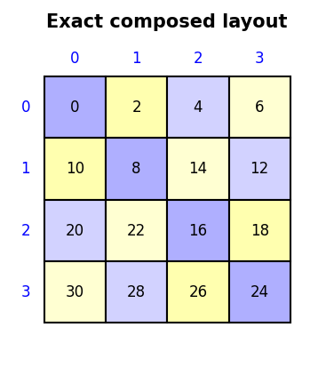
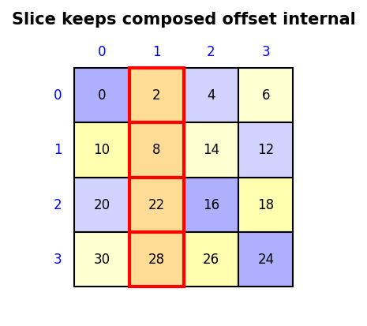

<!--
MIT License

Copyright (c) 2026 Meta Platforms, Inc. and affiliates.

Permission is hereby granted, free of charge, to any person obtaining a copy
of this software and associated documentation files (the "Software"), to deal
in the Software without restriction, including without limitation the rights
to use, copy, modify, merge, publish, distribute, sublicense, and/or sell
copies of the Software, and to permit persons to whom the Software is
furnished to do so, subject to the following conditions:

The above copyright notice and this permission notice shall be included in all
copies or substantial portions of the Software.

THE SOFTWARE IS PROVIDED "AS IS", WITHOUT WARRANTY OF ANY KIND, EXPRESS OR
IMPLIED, INCLUDING BUT NOT LIMITED TO THE WARRANTIES OF MERCHANTABILITY,
FITNESS FOR A PARTICULAR PURPOSE AND NONINFRINGEMENT. IN NO EVENT SHALL THE
AUTHORS OR COPYRIGHT HOLDERS BE LIABLE FOR ANY CLAIM, DAMAGES OR OTHER
LIABILITY, WHETHER IN AN ACTION OF CONTRACT, TORT OR OTHERWISE, ARISING FROM,
OUT OF OR IN CONNECTION WITH THE SOFTWARE OR THE USE OR OTHER DEALINGS IN THE
SOFTWARE.
-->

# Layout Algebra API

This document covers the core `tensor_layouts` API: constructing layouts,
querying their properties, and applying the four algebraic operations
(compose, complement, divide, product).

For runnable examples see [`examples/layouts.py`](../examples/layouts.py)
and [`examples/composed.py`](../examples/composed.py).
For visualization see [`docs/viz_api.md`](viz_api.md).

## What is a Layout?

A `Layout` is a function from logical coordinates to memory offsets:

```
offset = sum(coord_i * stride_i)
```

It is defined by a `(shape, stride)` pair.  The **shape** describes the
logical domain (how many elements along each dimension); the **stride**
describes how far apart elements are in memory along that dimension.

```python
from tensor_layouts import Layout

col_major = Layout((4, 8), (1, 4))   # offset(i,j) = i + 4*j
row_major = Layout((4, 8), (8, 1))   # offset(i,j) = 8*i + j
```

Shapes can be **hierarchically nested** — tuples of tuples — to describe
tiled access patterns, interleaved threads, or any multi-level structure:

```python
tiled = Layout(((2, 3), (2, 4)), ((1, 6), (2, 12)))
# 2x2 tiles arranged in a 3x4 grid = 6 rows x 8 columns
```

## Construction

| Form | Description |
|------|-------------|
| `Layout(shape, stride)` | Explicit shape and stride |
| `Layout(shape)` | Column-major strides computed automatically |
| `Layout(layout_a, layout_b)` | Bundle two layouts as modes of one layout |

```python
Layout((4, 8), (1, 4))   # explicit
Layout((4, 8))            # same as above (column-major default)
Layout(8, 2)              # 1D: 8 elements with stride 2
Layout((4, 8), (0, 1))   # broadcast: all rows map to same offsets
```

## Coordinate Mapping

Call a layout to map coordinates to offsets:

```python
layout = Layout((4, 8), (1, 4))

layout(2, 3)    # 14  — multi-dimensional coordinate
layout(14)      # 14  — flat index (column-major order through domain)
```

## Query Functions

All query functions work on layouts, composed layouts, tuples, and ints.

| Function | Description | Example |
|----------|-------------|---------|
| `size(L)` | Total number of elements | `size(Layout((4, 8))) == 32` |
| `cosize(L)` | Max offset + 1 (codomain span) | `cosize(Layout((4, 8), (8, 1))) == 32` |
| `rank(L)` | Number of top-level modes | `rank(Layout((4, 8))) == 2` |
| `depth(L)` | Maximum nesting depth | `depth(Layout(((2,3), 4))) == 2` |
| `mode(L, i)` | Extract mode `i` as a Layout | `mode(Layout((4, 8), (1, 4)), 0) == Layout(4, 1)` |

For `ComposedLayout`, `size`, `rank`, `depth`, and `shape` all come from the
**inner** layout domain, matching CuTe C++.

## Layout Expressions and `ComposedLayout`

Most user-facing APIs now accept a **layout expression**:

```python
LayoutExpr = Layout | ComposedLayout
```

`Layout` is still the normal affine case: it has a shape tree and a stride
tree, and it may also carry one canonical final swizzle.

`ComposedLayout` is the exact fallback for compositions that cannot be
represented as `Layout + one swizzle` without changing behavior.

```python
from tensor_layouts import ComposedLayout, Layout, Swizzle, compose

base = Layout((4, 4), (4, 1))
swizzled = compose(Swizzle(2, 0, 2), base)   # still a plain Layout
exact = compose(Layout(16, 2), swizzled)     # now a ComposedLayout
```

Semantics:

```python
ComposedLayout(outer, inner, preoffset)(coord) == outer(preoffset + inner(coord))
```

This mirrors CuTe C++'s `LayoutA o Offset o LayoutB` model:

- `inner` defines the logical domain
- `preoffset` stays **inside** the composition, before the outer map
- `outer` can be affine or nonlinear (for example a `Swizzle`)

The practical reason for `preoffset` is slicing. Once a fixed coordinate has
been pushed under a nonlinear outer map, that fixed contribution can no longer
be treated as an ordinary pointer offset.

### Trait helpers

Use the trait helpers to distinguish generic layout-expressions from
affine-only code paths:

| Helper | Meaning |
|--------|---------|
| `is_layout(x)` | True for both `Layout` and `ComposedLayout` |
| `is_affine_layout(x)` | True only for `Layout` |
| `as_layout_expr(x)` | Accept generic layout consumers |
| `as_affine_layout(x)` | Reject `ComposedLayout` with a clear error |

`ComposedLayout` intentionally does **not** expose `.stride`. If you need a
stride tree, you are in an affine-only path and should say so explicitly.

### When `compose()` returns `Layout` vs `ComposedLayout`

The fast path is preserved for the common canonical case:

```python
compose(Swizzle(2, 0, 2), Layout((4, 4), (4, 1)))
# Layout((4, 4), (4, 1), swizzle=Swizzle(2, 0, 2))
```

That is still a `Layout` because "a swizzled layout is a layout" remains the
intended Python representation for the single-final-swizzle case.

Once the result would require more than one nonlinear stage, Python now keeps
the composition exact instead of guessing a replacement swizzle:

```python
base = Layout((8, 8), (8, 1))
inner = compose(Swizzle(3, 0, 3), base)

compose(Swizzle(1, 0, 3), inner)
# ComposedLayout(Swizzle(1, 0, 3), inner, preoffset=0)

compose(Layout((4, 4), (4, 1)), inner)
# ComposedLayout(Layout((4, 4), (4, 1)), inner, preoffset=0)
```

That is the key semantic change: the library now prefers **exactness** over an
unsafe normalization.

### Example: canonical fast path vs exact fallback

```python
from tensor_layouts import Layout, Swizzle, compose

base = Layout((4, 4), (4, 1))

canonical = compose(Swizzle(2, 0, 2), base)
type(canonical).__name__
# 'Layout'

exact = compose(Layout(16, 2), canonical)
type(exact).__name__
# 'ComposedLayout'
```



### Example: why slicing needs `preoffset`

```python
exact = compose(
    Layout(16, 2),
    compose(Swizzle(2, 0, 2), Layout((4, 4), (4, 1))),
)

sub, offset = slice_and_offset((None, 1), exact)
print(sub)
print(offset)
```

The slice returns:

- a new `ComposedLayout` whose internal `preoffset` captures the fixed column
- external offset `0`

That differs from plain affine slicing, where `slice_and_offset` can usually
return `(affine_sublayout, integer_offset)`.



### Notes on `cosize`

For `ComposedLayout`, `cosize()` follows CuTe C++ and delegates to the inner
domain layout. It is **not** the exact image span of the outer nonlinear map.
If you need real addressed bounds, use a Tensor with storage validation or
enumerate the image directly.

### Notebook note

The existing notebooks still mostly exercise the canonical
`compose(Swizzle, Layout(...))` fast path, so their visible outputs stay
stable. For exact multi-stage compositions, use
[`examples/composed.py`](../examples/composed.py) as the primary runnable
reference.

## Iteration

`iter_layout(L)` yields `(coordinate, offset)` pairs for every element,
iterating in colexicographic order (flat index 0, 1, 2, ...).

`Layout` supports `__iter__` (yields coordinates) and `__len__`:

```python
layout = Layout((4, 8), (1, 4))

len(layout)                        # 32
list(layout)                       # [(0, 0), (1, 0), ..., (3, 7)]

for coord in layout:
    offset = layout(coord)         # map coordinate to offset

# iter_layout yields (coord, offset) pairs
for coord, offset in iter_layout(layout):
    ...

# Collect unique offsets
{layout(c) for c in layout}
```

## Utility Functions

Higher-level helpers like `make_ordered_layout`, `tile_to_shape`,
`make_layout_like`, and `tile_mma_grid` live in `tensor_layouts.layout_utils`
and should be imported explicitly:

```python
from tensor_layouts.layout_utils import make_ordered_layout

col_major = make_ordered_layout((4, 8))           # (4,8):(1,4)
row_major = make_ordered_layout((4, 8), (1, 0))   # (4,8):(8,1)
```

## Layout Manipulation

| Function | Description |
|----------|-------------|
| `flatten(L)` | Remove all nesting, produce flat modes |
| `coalesce(L)` | Merge adjacent modes with compatible strides |
| `sort(L)` | Reorder modes by stride (ascending) |
| `append(L, M)` | Add mode M after L's modes |
| `prepend(L, M)` | Add mode M before L's modes |
| `group(L, i, j)` | Nest modes i..j into a single hierarchical mode |
| `upcast(L, n)` | Reinterpret from finer to coarser coordinates (÷ n) |
| `downcast(L, n)` | Reinterpret from coarser to finer coordinates (× n) |

### upcast / downcast

`upcast(layout, n)` reinterprets a layout from a finer coordinate space to
a coarser one.  Mirrors CuTe's `upcast<N>`.  The typical use is converting
a layout in **bit** coordinates to **element** coordinates by dividing by
the element width in bits.

For the stride-1 (innermost) mode, the shape shrinks by `n`.  All strides
are divided by `n`.  `downcast` is the inverse.

```python
from tensor_layouts import Layout, upcast, downcast

# Bit layout for SM75 LDMATRIX x4 (dst side)
bits = Layout((32, (32, 4)), (32, (1, 1024)))

# Convert to fp16 elements (16 bits each)
elems = upcast(bits, 16)    # Layout((32, (2, 4)), (2, (1, 64)))

# Convert back
assert downcast(elems, 16) == bits
```

## Tuple Arithmetic

These operate on the nested integer tuples that make up shapes and strides.

| Function | Description | Example |
|----------|-------------|---------|
| `prefix_product(t)` | Running product (exclusive) | `prefix_product((2,3,4)) == (1,2,6)` |
| `suffix_product(t)` | Running product from right | `suffix_product((2,3,4)) == (12,4,1)` |
| `inner_product(a, b)` | Sum of element-wise products | `inner_product((2,3), (4,5)) == 23` |
| `elem_scale(a, b)` | Element-wise multiply | `elem_scale((2,3), (4,5)) == (8,15)` |

`prefix_product` computes column-major strides; `suffix_product` computes
row-major strides.

## Shape Factorization

`shape_div(shape, d)` and `shape_mod(shape, d)` factor a hierarchical shape
into the part that remains and the part that was consumed, proceeding from
the innermost modes first.

```python
shape_div((6, 2), 3)  # (2, 2)
shape_mod((6, 2), 3)  # (3, 1)

# Complementary size identity for supported inputs:
size(shape_div((6, 2), 3)) * size(shape_mod((6, 2), 3))  # 12
```

Policy note: this Python implementation intentionally uses a stricter scalar
rule than dynamic CuTe C++. At each scalar recursive step, either the shape
must divide the divisor or the divisor must divide the shape. If neither is
true, `shape_div` raises `ValueError`:

```python
shape_div(12, 4)  # 3
shape_div(4, 12)  # 1
shape_div(6, 4)   # ValueError
shape_div(4, 6)   # ValueError
```

This differs from dynamic CuTe C++, which may return `2` and `1` for the
last two cases. The stricter Python rule matches `pycute` and keeps
`shape_div`/`shape_mod` complementary for the educational runtime algebra.

## Core Algebra

### compose(A, B)

Function composition: `C(i) = A(B(i))`.

B selects which elements of A to visit, and in what order.  The result has
B's shape.

```python
compose(Layout(8, 2), Layout(4, 1))  # Layout(4, 2)
# B picks indices 0..3 from A; A maps each to 0,2,4,6

compose(Layout((4, 8), (8, 1)), (2, 4))  # Layout((2, 4), (8, 1))
# Select the top-left 2x4 subblock (mode-by-mode with shape tiler)

compose(Layout(((2, 3), 8), ((1, 2), 6)), ((2, 3), 4))
# Layout(((2, 3), 4), ((1, 2), 6))
# Nested tuple tilers recurse within the corresponding mode instead of
# being flattened into a single stride-1 layout.
```

When `A` is a `Swizzle`, the canonical `compose(Swizzle, affine Layout)` case
still returns a `Layout` with an embedded swizzle. If `B` is already swizzled
or composed, `compose()` returns a `ComposedLayout` instead so the composition
remains exact.

### complement(L, bound)

The layout that fills in L's codomain gaps up to `bound`.

```python
complement(Layout(4, 2), 16)  # Layout((2, 2), (1, 8))
# L visits {0,2,4,6}; complement visits the gaps {0,1} and extends to 16
```

Together, `Layout(L, complement(L))` covers every offset exactly once.

### logical_divide(L, T)

Split L into `(tile, rest)` — the core tiling operation.

```python
logical_divide(Layout(16, 1), 4)  # Layout((4, 4), (1, 4))
# 4-element tiles, 4 tiles total

logical_divide(Layout(4, 3), 4)   # Layout((4, 1), (3, 0))
# CuTe canonicalizes any extent-1 tile/rest mode to stride 0.

logical_divide(Layout(((2, 3), 8), ((1, 2), 6)), ((2, 3), 4))
# Divide mode 0 recursively by (2, 3), and mode 1 by 4.
```

Variants control result organization:

| Function | Result structure |
|----------|-----------------|
| `logical_divide` | `((tile0, rest0), (tile1, rest1), ...)` |
| `zipped_divide` | `((tiles), (rests))` |
| `tiled_divide` | `((tiles), rest0, rest1, ...)` |
| `flat_divide` | `(tile0, tile1, rest0, rest1, ...)` |

When `T` is a true `Layout`, the divide variants preserve its stride
structure instead of silently reducing it to `T.shape`:

```python
A = Layout((8, 8), (1, 8))
T = Layout((2, 2), (1, 4))

logical_divide(A, T)  # Layout(((2, 2), (2, 8)), ((1, 4), (2, 8)))
zipped_divide(A, T)   # same as logical_divide(A, T)
tiled_divide(A, T)    # Layout(((2, 2), 2, 8), ((1, 4), 2, 8))
flat_divide(A, T)     # Layout((2, 2, 2, 8), (1, 4, 2, 8))
```

### logical_product(A, B)

Replicate A's pattern at each position B describes.

```python
logical_product(Layout(4, 1), Layout(3, 1))  # Layout((4, 3), (1, 4))
# 4-element tile repeated 3 times: offsets [0..3], [4..7], [8..11]
```

| Function | Description |
|----------|-------------|
| `logical_product` | Concatenates tile and replication |
| `blocked_product` | Interleaves corresponding modes |
| `raked_product` | Interleaves within each tile |

## Inverse

| Function | Property |
|----------|----------|
| `right_inverse(L)` | `L(R(i)) == i` for all valid i |
| `left_inverse(L)` | `R(L(i)) == i` for all valid i |
| `max_common_layout(A, B)` | Largest layout that divides both A and B |

## Swizzle

`Swizzle(bits, base, shift)` is an XOR-based permutation for GPU shared
memory bank conflict avoidance:

```python
sw = Swizzle(3, 0, 3)
sw(offset)  # offset XOR ((offset >> 3) & 0b111)
```

Compose a Swizzle with a Layout to embed it:

```python
swizzled = compose(Swizzle(3, 0, 3), Layout((8, 8), (8, 1)))
# swizzled(i, j) applies the XOR after computing the linear offset
```

## Tensor

See [`docs/tensor_api.md`](tensor_api.md).

## Tile

`Tile(L0, L1, ...)` is a tuple of Layouts for mode-by-mode composition:

```python
layout = Layout((12, 8), (8, 1))
tiler = Tile(Layout(3, 1), Layout(4, 1))
compose(layout, tiler)  # Layout((3, 4), (8, 1)) — top-left 3x4 subblock
```

A plain tuple of ints `(3, 4)` works as shorthand for
`Tile(Layout(3, 1), Layout(4, 1))`.

## GPU Analysis

GPU-specific analysis functions live in `tensor_layouts.analysis`.
See [`docs/analysis_api.md`](analysis_api.md).
