<!--
MIT License

Copyright (c) 2026 Meta Platforms, Inc. and affiliates.

Permission is hereby granted, free of charge, to any person obtaining a copy
of this software and associated documentation files (the "Software"), to deal
in the Software without restriction, including without limitation the rights
to use, copy, modify, merge, publish, distribute, sublicense, and/or sell
copies of the Software, and to permit persons to whom the Software is
furnished to do so, subject to the following conditions:

The above copyright notice and this permission notice shall be included in all
copies or substantial portions of the Software.

THE SOFTWARE IS PROVIDED "AS IS", WITHOUT WARRANTY OF ANY KIND, EXPRESS OR
IMPLIED, INCLUDING BUT NOT LIMITED TO THE WARRANTIES OF MERCHANTABILITY,
FITNESS FOR A PARTICULAR PURPOSE AND NONINFRINGEMENT. IN NO EVENT SHALL THE
AUTHORS OR COPYRIGHT HOLDERS BE LIABLE FOR ANY CLAIM, DAMAGES OR OTHER
LIABILITY, WHETHER IN AN ACTION OF CONTRACT, TORT OR OTHERWISE, ARISING FROM,
OUT OF OR IN CONNECTION WITH THE SOFTWARE OR THE USE OR OTHER DEALINGS IN THE
SOFTWARE.
-->

# Visualization API

This document covers the `tensor_layouts.viz` module for drawing layouts,
swizzle comparisons, MMA atoms, and more.

Requires: `pip install tensor-layouts[viz]` (adds matplotlib).

For runnable examples see [`examples/viz.py`](../examples/viz.py)
and the Jupyter notebook [`examples/viz.ipynb`](../examples/viz.ipynb).
For the core layout algebra see [`docs/layout_api.md`](layout_api.md).

From a repo checkout, install the package first and then run the example script:

```bash
pip install -e ".[viz]"
python3 examples/viz.py
```

## Output and Display

Every `draw_*` function accepts a `filename` parameter:

| `filename` | Behavior |
|------------|----------|
| `None` (default) | Display inline in Jupyter, or `plt.show()` |
| `"out.svg"` | Save as SVG (vector) |
| `"out.png"` | Save as PNG (raster) at specified `dpi` |
| `"out.pdf"` | Save as PDF (vector) |

The `show_*` functions always display inline and return the matplotlib
`Figure` for further customization.

## draw_layout

Draw a single layout as a grid of cells showing memory offsets.

```python
from tensor_layouts import Layout
from tensor_layouts.viz import draw_layout

draw_layout(Layout((8, 8), (8, 1)), title="Row-Major 8x8", colorize=True)
```

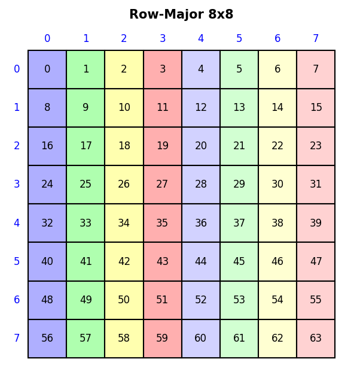

**Parameters:**

| Parameter | Type | Default | Description |
|-----------|------|---------|-------------|
| `layout` | `Layout` | required | The layout to draw |
| `filename` | `str` | `None` | Output path (format from extension) |
| `title` | `str` | `None` | Title above the grid |
| `dpi` | `int` | `150` | Resolution for raster output |
| `figsize` | `(w, h)` | auto | Figure size in inches |
| `colorize` | `bool` | `False` | Use rainbow colors (by cell value) |
| `color_layout` | `Layout` | `None` | Custom coloring (see below) |
| `color_by` | `str` | `None` | Shorthand: `"row"`, `"column"`, or `"offset"`. Mutually exclusive with `color_layout` |
| `num_shades` | `int` | `8` | Number of distinct grayscale shades |
| `flatten_hierarchical` | `bool` | `True` | Flatten nested shapes to 2D grid |
| `label_hierarchy_levels` | `bool` | `False` | In nested hierarchical mode, annotate hierarchy levels at tile/block granularity; label colors match boundary colors |
| `cell_labels` | `bool`, `str`, or `list` | `True` | Controls cell text: `True` = full detail, `"offset"` = offset number only, `False` = no text, list/tuple = custom labels indexed by offset |
| `interleave_colors` | `bool` | `False` | Reorder rainbow palette so consecutive indices share hues (blue, lt blue, green, lt green, ...). |

### Coloring

By default cells are shaded in grayscale by their offset value.  The shades
use a bit-reversal ordering (matching CUTLASS `TikzColor_BWx8`) so that
consecutive offsets get maximally different brightness — this avoids a
jarring light→dark→light sawtooth when the palette wraps around mid-tile.
Use `colorize=True` for rainbow colors.

The `color_layout` parameter gives fine control over which cells share
colors. It is evaluated in the same logical coordinate space as the layout
being drawn, so displayed cell `(row, col)` is colored by the value of
`color_layout` at that logical coordinate. For ordinary 2D layouts, this
means `color_layout` should usually have the same shape as the layout being
drawn:

```python
layout = Layout((8, 8), (8, 1))

# Color by row (same row = same color)
draw_layout(layout, color_layout=Layout((8, 8), (1, 0)), colorize=True)

# Color by column (same column = same color)
draw_layout(layout, color_layout=Layout((8, 8), (0, 1)), colorize=True)

# Uniform color (no variation)
draw_layout(layout, color_layout=Layout(1, 0))
```

| By row | By column | Uniform |
|--------|-----------|---------|
| 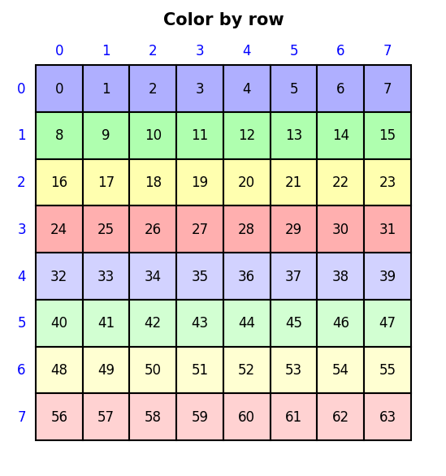 | 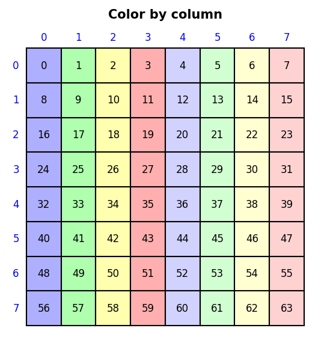 | 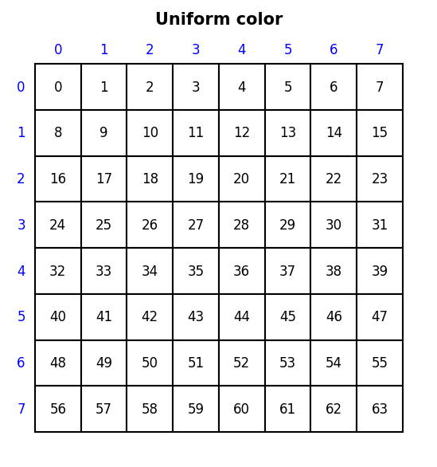 |

### Hierarchical Layouts

When `flatten_hierarchical=True` (default), nested shapes are flattened
to a 2D grid. Set it to `False` to show explicit pedagogical labels inside
each cell:

- `row=...` = nested row coordinate
- `col=...` = nested column coordinate
- `offset=...` = resulting offset

The axes remain simple displayed row/column indices (`R0`, `R1`, ... and
`C0`, `C1`, ...), while tile boundaries still reveal the higher-level
structure:

```python
hier = Layout(((2, 3), (2, 4)), ((1, 6), (2, 12)))
draw_layout(hier, flatten_hierarchical=False, title="With explicit nested coordinates")
```

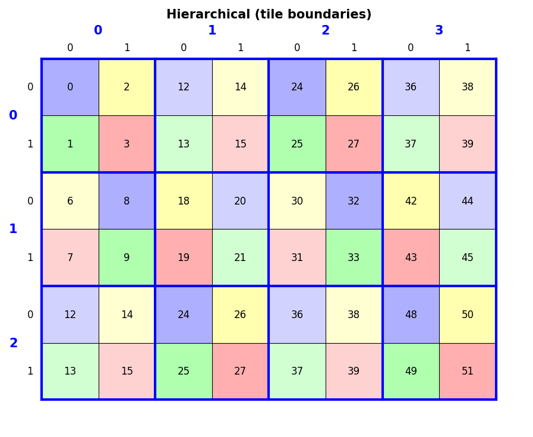

This nested view is intended to be pedagogical: instead of showing only a
flattened offset grid, it makes the mapping explicit cell-by-cell.

For deeper hierarchies, you can also label each hierarchy level on the axes:

```python
hier3 = Layout(((2, 3, 2), (3, 2, 2)), ((1, 2, 6), (12, 36, 72)))
draw_layout(
    hier3,
    "hier_3level_asymmetric_nested.svg",
    flatten_hierarchical=False,
    label_hierarchy_levels=True,
    title="3-level asymmetric hierarchy",
)
```

In that mode, the axes still represent displayed rows/columns, but hierarchy
labels are drawn at the granularity of the corresponding blocks/tiles rather
than on every row and column. Boundary colors and label colors match by level,
making the nesting structure easier to read.

The per-level axis labels use the same indexing convention as the in-cell
coordinates, e.g. `row[0]=...`, `row[1]=...`, `col[0]=...`, `col[1]=...`.

For examples where the hierarchy itself is central to the lesson, enabling
`label_hierarchy_levels=True` is recommended.

#### Cell Label Modes

The verbose row/col/offset labels can be distracting on larger grids. Use
`cell_labels` to control what text appears inside cells:

```python
hier = Layout(((2, 2), (2, 2)), ((1, 4), (2, 8)))

# Offset number only — hierarchy boundaries and axis labels are preserved
draw_layout(hier, flatten_hierarchical=False, label_hierarchy_levels=True,
            cell_labels="offset")

# No text at all — just colored grid with hierarchy boundaries
draw_layout(hier, flatten_hierarchical=False, label_hierarchy_levels=True,
            cell_labels=False, colorize=True)

# Custom labels indexed by offset value
import string
draw_layout(hier, cell_labels=list(string.ascii_uppercase[:size(hier)]),
            colorize=True)
```

`cell_labels` also works in flat mode (`flatten_hierarchical=True`), where
`False` suppresses offset numbers and a list provides custom labels.

You can push this further with deeper asymmetric hierarchies to test how the
level labels behave when cells become small:

```python
hier4 = Layout(((3, 2, 2, 2), (4, 2, 2, 2)),
               ((1, 3, 6, 12), (24, 96, 192, 384)))
draw_layout(
    hier4,
    "hier_4level_asymmetric_nested.svg",
    flatten_hierarchical=False,
    label_hierarchy_levels=True,
    title="4-level asymmetric hierarchy",
)
```

## draw_swizzle

Side-by-side comparison of a linear layout and its swizzled version.

```python
from tensor_layouts import Layout, Swizzle
from tensor_layouts.viz import draw_swizzle

draw_swizzle(Layout((8, 8), (8, 1)), Swizzle(3, 0, 3), colorize=True)
```

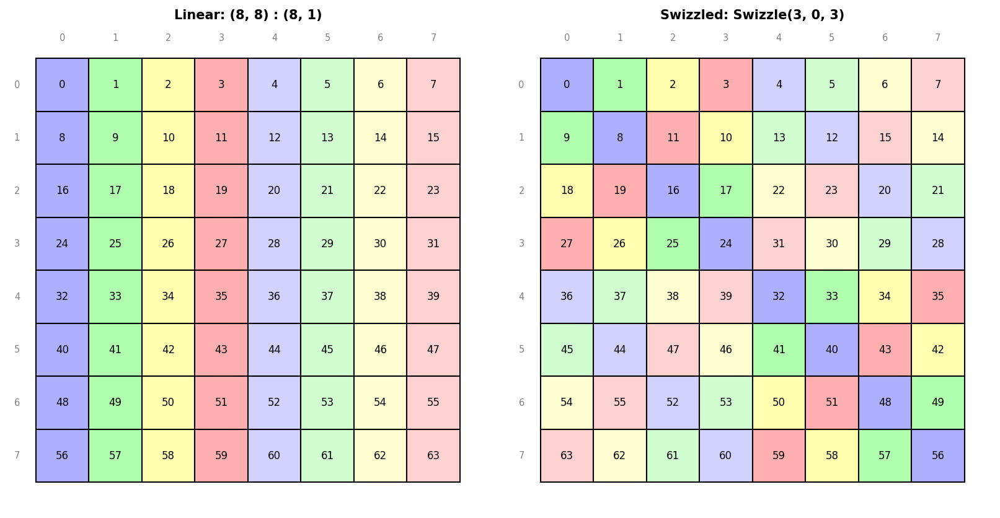

**Parameters:**

| Parameter | Type | Default | Description |
|-----------|------|---------|-------------|
| `base_layout` | `Layout` | required | The linear (un-swizzled) layout |
| `swizzle` | `Swizzle` | required | The swizzle to apply |
| `filename` | `str` | `None` | Output path |
| `dpi` | `int` | `150` | Resolution |
| `figsize` | `(w, h)` | auto | Figure size |
| `colorize` | `bool` | `False` | Rainbow colors |
| `num_shades` | `int` | `8` | Grayscale shades |

## draw_tv_layout

Draw a Thread-Value layout with T (thread ID) and V (value index) labels
in each cell.  Used for visualizing how GPU threads map to matrix elements.

```python
from tensor_layouts.atoms_nv import *
from tensor_layouts.viz import draw_tv_layout

atom = SM80_16x8x16_F16F16F16F16_TN
draw_tv_layout(atom.c_layout, title="SM80 16x8x16 C (Thread-Value)", colorize=True)
```

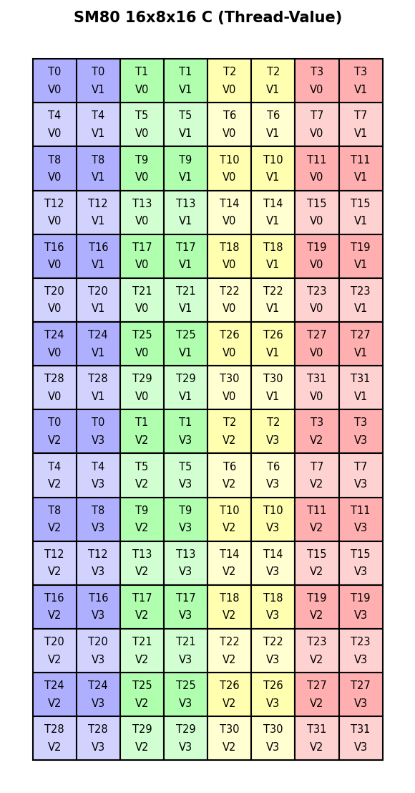

**Parameters:**

| Parameter | Type | Default | Description |
|-----------|------|---------|-------------|
| `layout` | `Layout` | required | Thread-value layout `(thread, value)` |
| `filename` | `str` | `None` | Output path |
| `title` | `str` | `None` | Title |
| `dpi` | `int` | `150` | Resolution |
| `figsize` | `(w, h)` | auto | Figure size |
| `colorize` | `bool` | `False` | Rainbow colors |
| `num_threads` | `int` | `None` | Override thread count for coloring |
| `grid_shape` | `(r, c)` | `None` | Force a specific grid shape |
| `thr_id_layout` | `Layout` | `None` | Custom thread-ID-to-color mapping |
| `col_major` | `bool` | `True` | Column-major grid ordering |

## draw_mma_layout

Draw an MMA atom's A, B, and C matrices in standard MMA arrangement
(B top-right, A bottom-left, C bottom-right).

```python
from tensor_layouts.atoms_nv import *
from tensor_layouts.viz import draw_mma_layout

atom = SM80_16x8x16_F16F16F16F16_TN
draw_mma_layout(atom.a_layout, atom.b_layout, atom.c_layout,
                tile_mnk=atom.shape_mnk, main_title=atom.name)
```

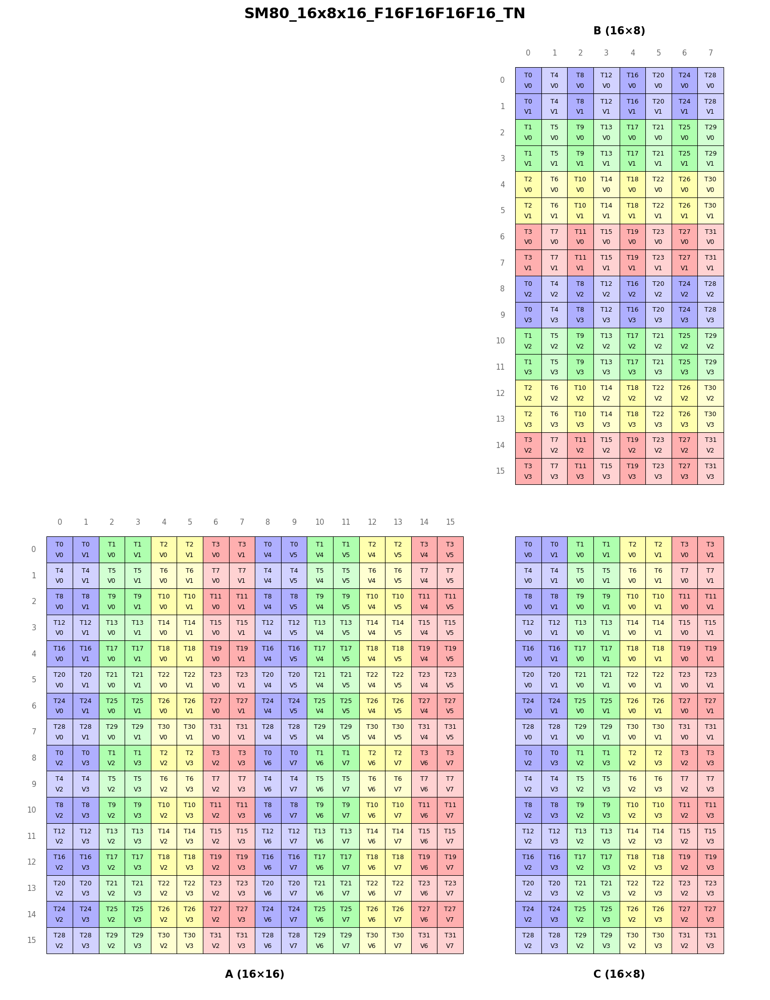

**Parameters:**

| Parameter | Type | Default | Description |
|-----------|------|---------|-------------|
| `layout_a` | `Layout` | required | A matrix TV layout |
| `layout_b` | `Layout` | required | B matrix TV layout |
| `layout_c` | `Layout` | required | C matrix TV layout |
| `filename` | `str` | `None` | Output path |
| `tile_mnk` | `(M, N, K)` | `None` | MMA tile dimensions; incompatible operand panels raise `ValueError` instead of clipping |
| `main_title` | `str` | `None` | Overall title |
| `dpi` | `int` | `150` | Resolution |
| `colorize` | `bool` | `True` | Rainbow colors |
| `thr_id_layout` | `Layout` | `None` | Custom thread-ID-to-color mapping |

## draw_slice

Draw a layout with sliced elements highlighted.

Slice specs use `None` for free dimensions and integers (or nested tuples
of integers/None) for fixed dimensions.  This is especially useful for
visualizing hierarchical slicing patterns from CuTe.

```python
from tensor_layouts import Layout
from tensor_layouts.viz import draw_slice

# Cecka's hierarchical tensor: ((3,2),((2,3),2)):((4,1),((2,15),100))
# Slice ((1,:),((:,0),:)) — fix inner-row=1 and middle-col=0
layout = Layout(((3, 2), ((2, 3), 2)), ((4, 1), ((2, 15), 100)))
draw_slice(layout, ((1, None), ((None, 0), None)), title="((1,:),((:,0),:))")
```

For 1D layouts, wrap the slice in a single-element tuple:

```python
draw_slice(Layout(8, 1), (slice(2, 5),), title="1D slice [2:5]")
```

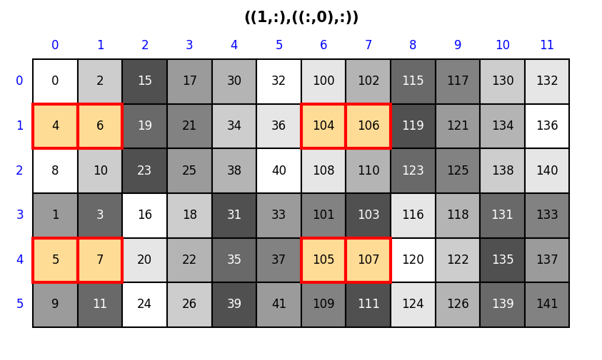

**Parameters:**

| Parameter | Type | Default | Description |
|-----------|------|---------|-------------|
| `layout` | `Layout` | required | The layout to draw |
| `slice_spec` | `tuple` | required | Coordinate with `None` for free dims |
| `filename` | `str` | `None` | Output path |
| `title` | `str` | `None` | Title |
| `dpi` | `int` | `150` | Resolution |
| `figsize` | `(w, h)` | auto | Figure size |
| `colorize` | `bool` | `False` | Rainbow colors |
| `color_layout` | `Layout` | `None` | Custom coloring in the layout's logical coordinate space |
| `num_shades` | `int` | `8` | Grayscale shades |

## draw_composite

Draw multiple layouts in a multi-panel figure.

```python
from tensor_layouts import Layout
from tensor_layouts.viz import draw_composite

panels = [Layout((4, 4), (4, 1)), Layout((4, 4), (1, 4))]
draw_composite(panels, "comparison.png",
               titles=["Row-Major", "Column-Major"],
               main_title="Layout Comparison", colorize=True)
```

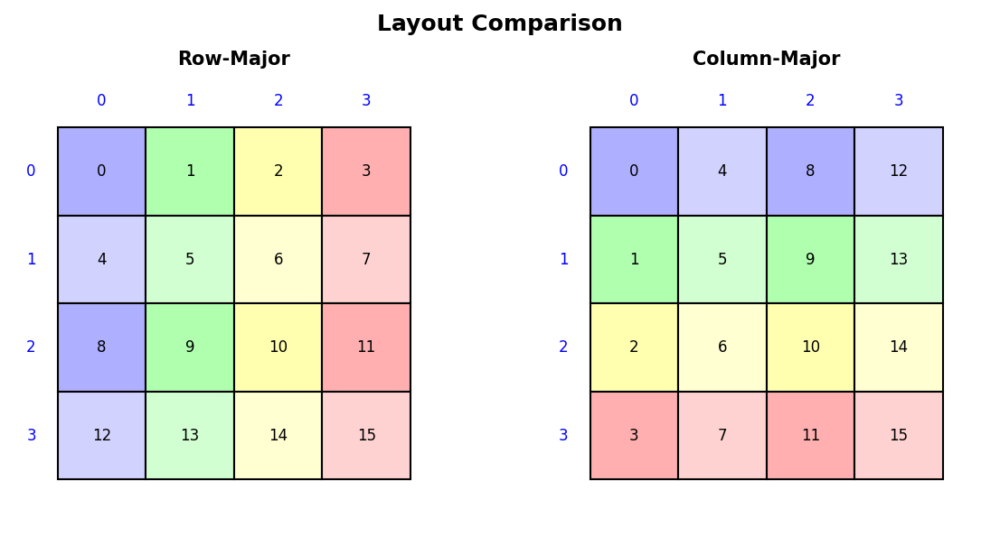

**Parameters:**

| Parameter | Type | Default | Description |
|-----------|------|---------|-------------|
| `panels` | `list` | required | List of Layouts to draw |
| `filename` | `str` | required | Output path |
| `arrangement` | `str` | `"horizontal"` | `"horizontal"` or `"vertical"` |
| `titles` | `list` | `None` | Per-panel titles |
| `main_title` | `str` | `None` | Overall title |
| `dpi` | `int` | `150` | Resolution |
| `panel_size` | `(w, h)` | `(4, 4)` | Size per panel |
| `colorize` | `bool` | `False` | Rainbow colors |
| `tv_mode` | `bool` | `False` | Use TV-layout rendering |
| `flatten_hierarchical` | `bool` | `True` | Flatten nested shapes to 2D grid |
| `label_hierarchy_levels` | `bool` | `False` | In nested hierarchical mode, annotate hierarchy levels |

Per-panel options (`(Layout, opts_dict)` tuples) override the top-level
defaults: `colorize`, `color_layout`, `num_colors`, `tv_mode`,
`flatten_hierarchical`, `label_hierarchy_levels`, and the TV-specific
`grid_rows`, `grid_cols`, `thr_id_layout`, `col_major`.

## draw_tiled_grid

Draw a tiled MMA grid produced by `tile_mma_grid()`.

```python
from tensor_layouts import Layout
from tensor_layouts.atoms_nv import *
from tensor_layouts.layout_utils import tile_mma_grid
from tensor_layouts.viz import draw_tiled_grid

atom = SM80_16x8x16_F16F16F16F16_TN
atom_layout = Layout((2, 2), (1, 2))  # 2x2 grid of atoms
grid, tile_shape = tile_mma_grid(atom, atom_layout, matrix='C')
draw_tiled_grid(grid, tile_shape[0], tile_shape[1],
                title="SM80 16x8x16 C — 2x2 atoms")
```

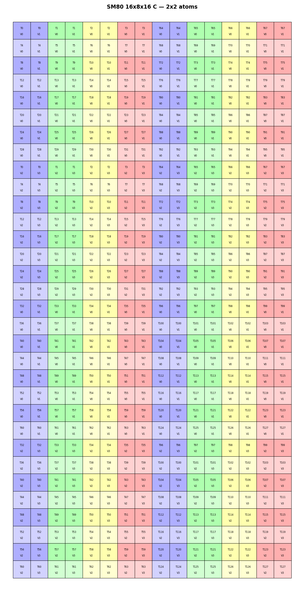

**Parameters:**

| Parameter | Type | Default | Description |
|-----------|------|---------|-------------|
| `grid` | `dict` | required | Grid data from `tile_mma_grid()` |
| `rows` | `int` | required | Number of tile rows |
| `cols` | `int` | required | Number of tile columns |
| `filename` | `str` | `None` | Output path |
| `dpi` | `int` | `150` | Resolution |
| `title` | `str` | `None` | Title |

## draw_copy_layout

Side-by-side source and destination TV grids for a copy operation.
Matches CUTLASS `print_latex_copy`: both panels use the same thread
coloring so data movement is visually traceable.

```python
from tensor_layouts import Layout, upcast
from tensor_layouts.atoms_nv import SM75_U32x4_LDSM_N
from tensor_layouts.viz import draw_copy_layout

atom = SM75_U32x4_LDSM_N
src = upcast(atom.src_layout_bits, 16)  # bit → fp16 elements
dst = upcast(atom.dst_layout_bits, 16)
draw_copy_layout(src, dst, title="SM75 LDMATRIX x4", colorize=True)
```

**Parameters:**

| Parameter | Type | Default | Description |
|-----------|------|---------|-------------|
| `src_layout` | `Layout` | required | Source TV layout `(thread, value)` |
| `dst_layout` | `Layout` | required | Destination TV layout `(thread, value)` |
| `filename` | `str` | `None` | Output path |
| `grid_shape` | `(r, c)` | `None` | Force grid shape (inferred from cosize if `None`) |
| `title` | `str` | `None` | Title |
| `dpi` | `int` | `150` | Resolution |
| `colorize` | `bool` | `True` | Rainbow colors by thread ID |
| `thr_id_layout` | `Layout` | `None` | Custom thread-ID-to-color mapping |
| `col_major` | `bool` | `True` | Column-major grid ordering |

## draw_combined_mma_grid

Draw combined A/B/C grid-dict panels in the standard MMA arrangement.
This is the grid-dict counterpart of `draw_mma_layout` — use it when
you have pre-computed `(row, col) → (phys_thread, value, logical_thread)`
dicts (e.g. from `tile_mma_grid`).

```python
from tensor_layouts import Layout
from tensor_layouts.atoms_nv import SM80_16x8x16_F16F16F16F16_TN
from tensor_layouts.layout_utils import tile_mma_grid
from tensor_layouts.viz import draw_combined_mma_grid

atom = SM80_16x8x16_F16F16F16F16_TN
atom_layout = Layout((2, 2), (1, 2))
c_grid, _ = tile_mma_grid(atom, atom_layout, 'C')
a_grid, _ = tile_mma_grid(atom, atom_layout, 'A')
b_grid, _ = tile_mma_grid(atom, atom_layout, 'B')
M, N, K = 32, 16, 16
draw_combined_mma_grid(a_grid, b_grid, c_grid, M, N, K,
                       title="SM80 2x2 TiledMMA")
```

**Parameters:**

| Parameter | Type | Default | Description |
|-----------|------|---------|-------------|
| `a_grid` | `dict` | required | A panel grid dict (M×K) |
| `b_grid` | `dict` | required | B panel grid dict (K×N) |
| `c_grid` | `dict` | required | C panel grid dict (M×N) |
| `M, N, K` | `int` | required | Panel dimensions |
| `filename` | `str` | `None` | Output path |
| `dpi` | `int` | `150` | Resolution |
| `title` | `str` | `None` | Title |

## Jupyter Inline Display

Every `draw_*` function has a corresponding `show_*` that displays inline
and returns the matplotlib `Figure`:

| `draw_*` | `show_*` |
|----------|----------|
| `draw_layout` | `show_layout` |
| `draw_swizzle` | `show_swizzle` |
| `draw_tv_layout` | `show_tv_layout` |
| `draw_mma_layout` | `show_mma_layout` |
| `draw_tiled_grid` | `show_tiled_grid` |
| `draw_copy_layout` | `show_copy_layout` |
| `draw_combined_mma_grid` | `show_combined_mma_grid` |
| `draw_slice` | `show_slice` |
| `draw_composite` | `show_composite` |

```python
from tensor_layouts.viz import show_layout, show_swizzle, show_tv_layout

fig = show_layout(Layout((8, 8), (8, 1)), colorize=True)
fig = show_swizzle(Layout((8, 8), (8, 1)), Swizzle(3, 0, 3))
fig = show_tv_layout(Layout((4, 2), (2, 1)), colorize=True)
```

| `show_layout` | `show_swizzle` |
|----------------|----------------|
| 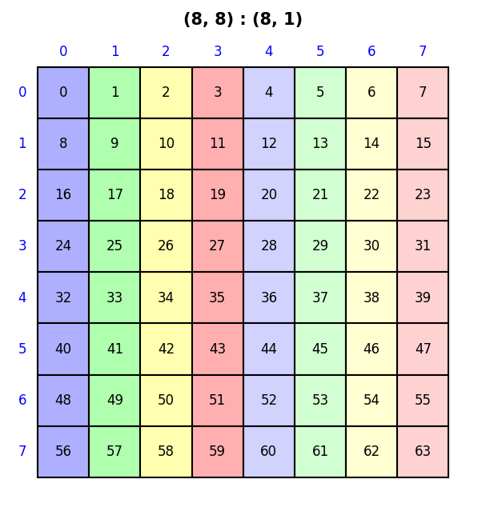 | 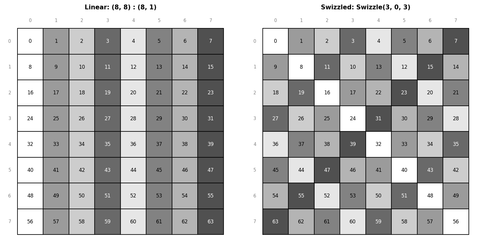 |
